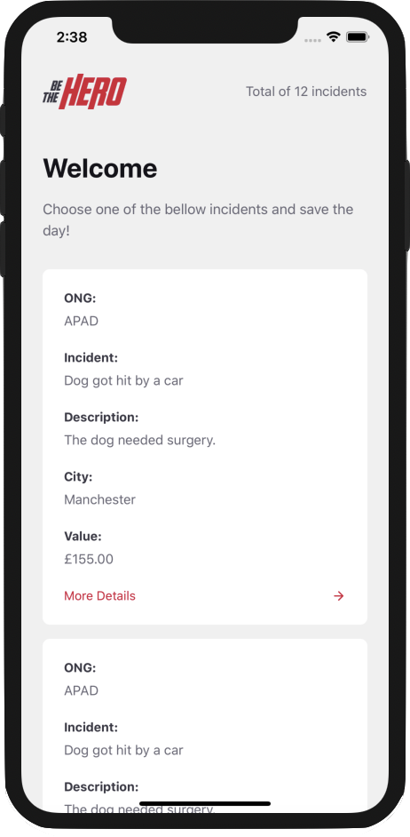

   

 
 

<table border="0">
 <tr>
    <td align="left">
    ### :rocket: Used Technologies 
- [Node.js](https://nodejs.org)
- [React.js](https://reactjs.org)
- [React Native](https://reactnative.dev)
- [Expo](https://expo.io/)
- [Express](https://expressjs.com)
- [Axios](https://www.npmjs.com/package/axios)
- [JWT](https://jwt.io)
- [Formik](https://jaredpalmer.com/formik/docs/overview)
- [Yup](https://github.com/jquense/yup)
- [Eslint](https://www.npmjs.com/package/eslint)
- [Jest](https://www.npmjs.com/package/jest)
    </td>
    <td align="center">
   
    </td>
 </tr>
</table>

 

### :computer: Project

<b>Be the Hero</b> it's a project that aims to help financial charity associations.

 

### :mortar_board: Teacher

OmniStack week 11.0 was guided by the [RocketSeat](https://github.com/Rocketseat)

 

### :nerd_face: Improvements

After complete the OmniStack week, I was forward and improved the project a little bit :muscle:

 - Transformed web project responsible
 - Implemented JWT authentication
 - Implemented Formik with Yup library to validate forms
 - Fixed bugs in the list of the mobile app when a new incident is created while the user is scrolling
 - Improved list in mobile app creating a new method to get the most recent incidents with gesture down

 

### :books: Conclusion

That was a awesome week full of knowledge where i could improved my knowledge in JavaScript, Node.js e React.js.
That week i could developed my first mobile app using React Native and very happy for that.
I'm already waiting for next Omnistack week! :hourglass_flowing_sand:

 
